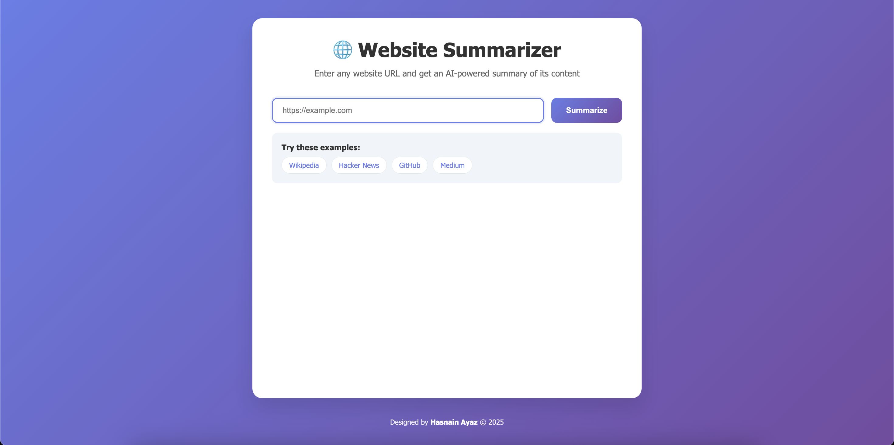
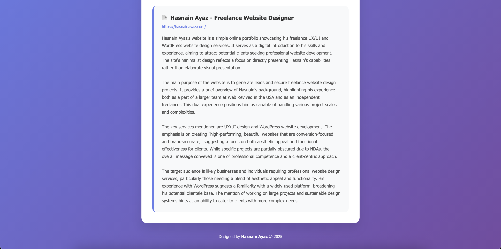

# 🌐 Website Summarizer

A beautiful, AI-powered web application that analyzes and summarizes any website's content using Google's Gemini AI. Simply enter a URL and get an intelligent, comprehensive summary of the website's purpose, key topics, and target audience.


*Clean, modern interface with gradient background and intuitive design*


*AI-powered analysis showing detailed website summary and results*

## ✨ Features

### 🤖 **AI-Powered Analysis**
- **Advanced Content Extraction**: Intelligently scrapes and processes website content
- **Gemini AI Integration**: Leverages Google's latest AI model for comprehensive analysis
- **Structured Summaries**: Provides organized insights including purpose, topics, and audience

### 🎨 **Beautiful User Experience**
- **Modern Design**: Elegant gradient interface with smooth animations
- **Responsive Layout**: Perfect experience on desktop, tablet, and mobile devices
- **Interactive Elements**: Hover effects, loading states, and example URL buttons
- **Professional Typography**: Clean, readable fonts and optimal spacing

### 🛡️ **Robust & Secure**
- **Smart Error Handling**: Graceful handling of invalid URLs and network issues
- **Input Validation**: Comprehensive URL validation and sanitization
- **Secure API Key Management**: Environment-based configuration
- **Rate Limiting**: Built-in request timeouts and error recovery

## 🚀 Quick Start

### 📋 Prerequisites

- **Python 3.7+** - [Download Python](https://python.org/downloads/)
- **Google API Key** - [Get from Google AI Studio](https://aistudio.google.com/app/apikey)
- **Git** (optional) - For cloning the repository

### ⚡ Installation

```bash
# 1. Clone the repository
git clone <repository-url>
cd website-summarizer

# 2. Install dependencies
pip install -r requirements.txt

# 3. Set up environment variables
cp env.example .env
# Edit .env and add your Google API key

# 4. Run the application
python app.py
```

### 🌐 Access the Application

Open your browser and navigate to: **`http://localhost:5000`**

> **💡 Pro Tip**: The app automatically focuses on the URL input field when loaded, so you can start typing immediately!

## 🔧 Configuration

### Environment Variables

Create a `.env` file in the project root with:

```env
GOOGLE_API_KEY=your_google_api_key_here
```

### Getting a Google API Key

1. Go to [Google AI Studio](https://aistudio.google.com/app/apikey)
2. Sign in with your Google account
3. Create a new API key
4. Copy the key and add it to your `.env` file

## 📖 How to Use

### 🔗 **Step 1: Enter URL**
Type or paste any website URL into the input field. The app supports various formats:
- `https://example.com`
- `www.example.com` (automatically adds https://)
- `example.com` (automatically adds https://)

### ⚡ **Step 2: Analyze**
Click the **"Summarize"** button and watch the AI work its magic. You'll see:
- Loading animation with progress indicator
- Real-time status updates

### 📊 **Step 3: Review Results**
Get a comprehensive, structured summary including:
- **Website Overview**: Clear description of the site's main purpose
- **Key Topics**: Primary subjects and services discussed
- **Target Audience**: Who the website is designed for
- **Content Analysis**: Main themes and messaging

### 🎯 **Example URLs to Try**

| Website | Description |
|---------|-------------|
| [Wikipedia](https://www.wikipedia.org) | Encyclopedia and knowledge base |
| [Hacker News](https://news.ycombinator.com) | Tech news and discussions |
| [GitHub](https://www.github.com) | Code hosting and collaboration |
| [Medium](https://www.medium.com) | Publishing platform and articles |

## 🏗️ Architecture & Workflow


### 🔄 **Processing Pipeline**

1. **🔍 URL Validation**: Comprehensive validation and format normalization
2. **🕷️ Web Scraping**: Intelligent content extraction using `requests` + `BeautifulSoup`
3. **🧹 Content Cleaning**: Removes navigation, ads, scripts, and irrelevant elements
4. **🤖 AI Analysis**: Sends optimized content to Google's Gemini AI
5. **📋 Summary Generation**: Returns structured, human-readable insights

## 🛠️ Technical Stack

### **Backend Architecture**
| Component | Technology | Purpose |
|-----------|------------|---------|
| **Web Framework** | Flask | Lightweight, fast API server |
| **Web Scraping** | `requests` + `BeautifulSoup4` | Content extraction and parsing |
| **AI Integration** | `google-generativeai` | Gemini AI API communication |
| **Environment** | `python-dotenv` | Secure configuration management |

### **Frontend Design**
| Feature | Implementation | Benefit |
|---------|---------------|---------|
| **Pure Web Stack** | HTML5 + CSS3 + Vanilla JS | Zero dependencies, fast loading |
| **Responsive Design** | CSS Grid + Flexbox | Works on all devices |
| **Modern UI** | CSS animations + gradients | Professional appearance |
| **Real-time UX** | JavaScript async/await | Smooth user interactions |

### **Security & Performance**
- **🔐 Environment Variables**: Secure API key storage
- **✅ Input Validation**: Comprehensive URL sanitization  
- **⚡ Rate Limiting**: Request timeouts and error recovery
- **🛡️ Error Handling**: Graceful failure management

## ⚠️ Limitations & Considerations

| Limitation | Description | Workaround |
|-----------|-------------|------------|
| **🚫 Bot Detection** | Some sites block automated scraping | Try different user agents or use proxy |
| **⏱️ Large Websites** | Complex sites may take longer to process | Content is automatically limited to 3000 chars |
| **🔐 Authentication** | Cannot access login-protected content | Only works with publicly accessible pages |
| **📊 Rate Limits** | Google AI Studio has usage quotas | Monitor your API usage dashboard |

## 🔒 Security & Privacy

### **🛡️ Security Best Practices**
- ✅ **Never commit `.env` files** to version control
- ✅ **Rotate API keys regularly** for enhanced security
- ✅ **Monitor API usage** to prevent unexpected charges
- ✅ **Use environment variables** for all sensitive data

### **🔐 Data Privacy**
- **No Data Storage**: Website content is processed in real-time and not stored
- **Secure Transmission**: All API calls use HTTPS encryption
- **Local Processing**: Content analysis happens via secure API calls only

## 🚀 Deployment Options

### **☁️ Cloud Platforms**
- **Heroku**: Easy deployment with git integration
- **Vercel**: Optimized for frontend + API deployment
- **Railway**: Modern platform with automatic deployments
- **Google Cloud Run**: Serverless container deployment

### **🏠 Self-Hosting**
- **Docker**: Containerized deployment for consistency
- **VPS**: Traditional server hosting with full control
- **Local Network**: Perfect for internal team usage

## 🤝 Contributing

We welcome contributions! Here's how you can help:

1. **🐛 Report Bugs**: Open an issue with detailed reproduction steps
2. **💡 Suggest Features**: Share your ideas for improvements
3. **🔧 Submit PRs**: Fork, develop, and submit pull requests
4. **📖 Improve Docs**: Help make the documentation even better

## 👨‍💻 Credits

**Designed & Developed by [Hasnain Ayaz](https://hasnainayaz.com/) © 2025**

*Freelance UX/UI & WordPress Designer based in Islamabad, Pakistan*

## 📄 License

This project is open source and available under the **MIT License**.

---

### ⭐ **Like this project? Give it a star!**

*Built with ❤️ using Flask, Google Gemini AI, and modern web technologies* 